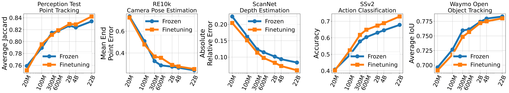

# 4D Representations

Welcome to the official Google DeepMind repository for 4D Representations.

* [Scaling 4D Representations](https://arxiv.org/abs/2412.15212) focuses on evaluating self-supervised learning on non-semantic vision tasks that are more spatial (3D) and temporal (+1D = 4D), such as camera pose estimation, point and object tracking, and depth estimation. We show that by learning from very large video datasets, masked auto-encoding (MAE) with transformer video models actually scales, consistently improving performance on these 4D tasks, as model size increases from 20M all the way to the largest by far reported self-supervised video model 22B parameters.



* [Moving Off-the-Grid (MooG)](https://openreview.net/pdf?id=rjSPDVdUaw) introduces a self-supervised video representation model that departs from conventional “on-the-grid’’ methods by allowing latent tokens to move freely across space and time, enabling them to stay aligned with scene elements as they shift on the image plane. By combining cross-attention with positional embeddings, MooG disentangles representation structure from image structure, allowing tokens to bind to meaningful scene components rather than fixed pixel locations. Trained with a simple next-frame prediction objective on raw video data, MooG naturally learns tokens that track objects and structures over time, and demonstrates strong performance on a variety of downstream tasks when lightweight readouts are applied. Overall, MooG provides a powerful and flexible off-the-grid representation, outperforming traditional grid-based baselines and establishing a strong foundation for diverse 4D vision applications.


## Installation

```bash
git clone https://github.com/google-deepmind/representations4d.git
cd representations4d

python3 -m venv representations4d_env
source representations4d_env/bin/activate
pip install .
```

## Demo

* [](https://colab.research.google.com/github/google-deepmind/representations4d/blob/main/colabs/scaling4d_depth_demo.ipynb) Depth estimation with 4DS-B-dist-e backbone

* [](https://colab.research.google.com/github/google-deepmind/representations4d/blob/main/colabs/moog_inference_demo.ipynb) Box tracking and point tracking with MooG backbone. Also see [Instructions](moog/README.md) to train MooG from scratch

## Checkpoints

We release the following checkpoints

| Name | Model | # Params | File Size | Checkpoint |
| -------- | ------- | :-------: | :-------: | :-------: |
| 4DS-B-dist-e | Backbone (ViT-B) | 88M | 334MB | [link](https://storage.googleapis.com/representations4d/checkpoints/scaling4d_dist_b.npz) |
| 4DS-e | Backbone (ViT-e) | 3.8B | 14GB | [link](https://storage.googleapis.com/representations4d/checkpoints/scaling4d_e.npz) |
| 4DS-B-dist-e ScanNet depth | Backbone (ViT-B) + Readout | 105M | 420MB | [link](https://storage.googleapis.com/representations4d/checkpoints/scaling4d_dist_b_depth.npz) |
| MooG | Backbone (ConvNet + Transformer) | 35M | 140MB | [link](https://storage.googleapis.com/representations4d/checkpoints/moog_ego4d_backbone_ckpt_164335139.npz) |
| MooG | Box Track Readout (Cross Attention) | 35M | 140MB | [link](https://storage.googleapis.com/representations4d/checkpoints/moog_ego4d_box_track_head_ckpt_164335139.npz) |
| MooG | Point Track Readout (Cross Attention) | 35M | 140MB | [link](https://storage.googleapis.com/representations4d/checkpoints/moog_ego4d_point_track_head_ckpt_164335139.npz) |

## Citing this work

```
@article{carreira2024scaling,
  title={Scaling 4D Representations},
  author={João Carreira and Dilara Gokay and Michael King and Chuhan Zhang and Ignacio Rocco and Aravindh Mahendran and Thomas Albert Keck and Joseph Heyward and Skanda Koppula and Etienne Pot and Goker Erdogan and Yana Hasson and Yi Yang and Klaus Greff and Guillaume Le Moing and Sjoerd van Steenkiste and Daniel Zoran and Drew A. Hudson and Pedro Vélez and Luisa Polanía and Luke Friedman and Chris Duvarney and Ross Goroshin and Kelsey Allen and Jacob Walker and Rishabh Kabra and Eric Aboussouan and Jennifer Sun and Thomas Kipf and Carl Doersch and Viorica Pătrăucean and Dima Damen and Pauline Luc and Mehdi S. M. Sajjadi and Andrew Zisserman},
  journal={arXiv preprint arXiv:2412.15212},
  year={2024}
}
```

```
@article{van2024moving,
  title={Moving Off-the-Grid: Scene-Grounded Video Representations},
  author={Sjoerd van Steenkiste and Daniel Zoran and Yi Yang and Yulia Rubanova and Rishabh Kabra and Carl Doersch and Dilara Gokay and Joseph Heyward and Etienne Pot and Klaus Greff and Drew Hudson and Thomas Albert Keck and João Carreira and Alexey Dosovitskiy and Mehdi S. M. Sajjadi and Thomas Kipf},
  journal={Advances in Neural Information Processing Systems},
  volume={37},
  pages={124319--124346},
  year={2024}
}
```

## License and disclaimer

Copyright 2025 Google LLC

All software is licensed under the Apache License, Version 2.0 (Apache 2.0);
you may not use this file except in compliance with the Apache 2.0 license.
You may obtain a copy of the Apache 2.0 license at:
https://www.apache.org/licenses/LICENSE-2.0

All other materials are licensed under the Creative Commons Attribution 4.0
International License (CC-BY). You may obtain a copy of the CC-BY license at:
https://creativecommons.org/licenses/by/4.0/legalcode

Unless required by applicable law or agreed to in writing, all software and
materials distributed here under the Apache 2.0 or CC-BY licenses are
distributed on an "AS IS" BASIS, WITHOUT WARRANTIES OR CONDITIONS OF ANY KIND,
either express or implied. See the licenses for the specific language governing
permissions and limitations under those licenses.

This is not an official Google product.
