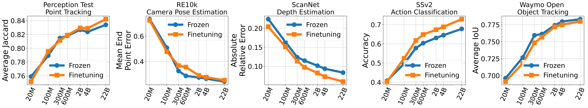
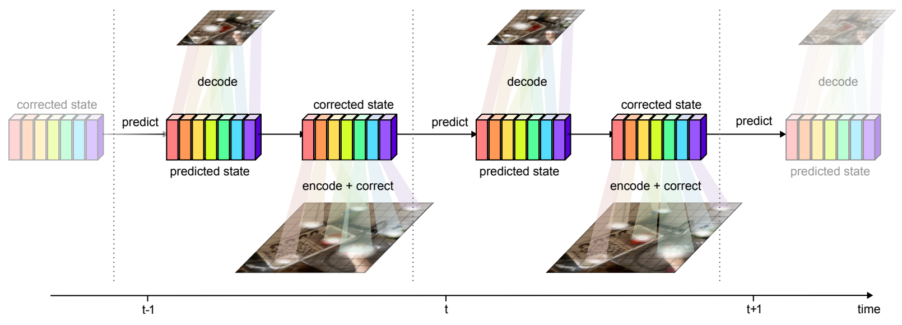
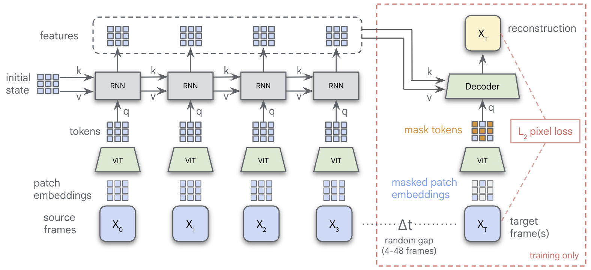
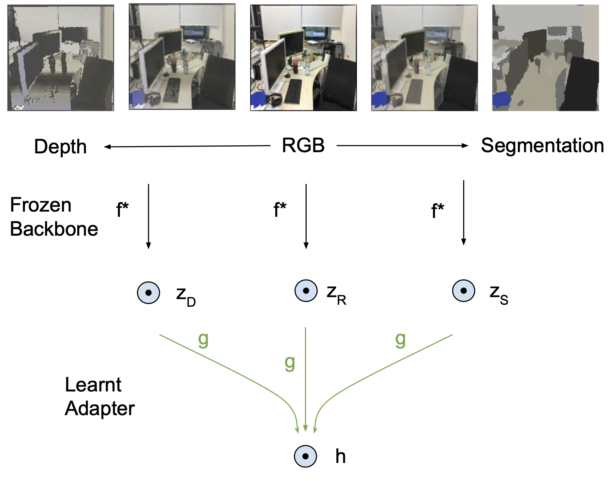

# 4D Representations

Welcome to the official Google DeepMind repository for 4D Representations.

* [Scaling 4D Representations](https://arxiv.org/abs/2412.15212) focuses on evaluating self-supervised learning on non-semantic vision tasks that are more spatial (3D) and temporal (+1D = 4D), such as camera pose estimation, point and object tracking, and depth estimation. We show that by learning from very large video datasets, masked auto-encoding (MAE) with transformer video models actually scales, consistently improving performance on these 4D tasks, as model size increases from 20M all the way to the largest by far reported self-supervised video model 22B parameters.



<!-- disableFinding(LINE_OVER_80) -->

* [Moving Off-the-Grid (MooG)](https://openreview.net/pdf?id=rjSPDVdUaw) introduces a self-supervised video representation that allows latent tokens to move freely across space and time, staying aligned with dynamic scene elements rather than fixed pixel grids. By combining cross-attention with positional embeddings, MooG disentangles representation structure from image structure, enabling tokens to bind to meaningful objects and regions. Trained with a simple next-frame prediction objective, MooG naturally learns object-centric tracking representations and achieves strong performance across downstream tasks with lightweight readouts.



* [Recurrent Video Masked Autoencoders (RVM)](https://arxiv.org/abs/2512.13684) proposes a recurrent, transformer-based approach to video representation learning that models temporal structure using an asymmetric masking objective and simple pixel reconstruction loss. RVM learns an efficient general-purpose encoder that matches or exceeds state-of-the-art video models on action recognition, tracking, and dense geometric tasks, while remaining competitive with strong image models. It is particularly effective in the small-model regime, achieving up to 30× greater parameter efficiency without distillation.



*[A Mixed Diet Makes DINO An Omnivorous Vision Encoder](https://arxiv.org/abs/2602.24181) proposes a lightweight post-training recipe to adapt visual foundation models like DINOv2. The objective is to increase feature alignment between multi-sensory views (e.g., RGB images and depth maps) of the same scene. Omnivorous post-training not only improves a vision model's representation alignment (e.g., facilitating cross-modal retrieval), but also its downstream scene understanding (on 3D and semantic tasks), and ability to transfer to novel unseen modalities.



## Installation

```bash
git clone https://github.com/google-deepmind/representations4d.git
cd representations4d

python3 -m venv representations4d_env
source representations4d_env/bin/activate
pip install .
```

## Demo

* [](https://colab.research.google.com/github/google-deepmind/representations4d/blob/main/colabs/scaling4d_depth_demo.ipynb) Depth estimation with 4DS-B-dist-e backbone

* [](https://colab.research.google.com/github/google-deepmind/representations4d/blob/main/colabs/moog_inference_demo.ipynb) Box tracking and point tracking with MooG backbone

* [](https://colab.research.google.com/github/google-deepmind/representations4d/blob/main/colabs/rvm_inference_demo.ipynb) Segmentation tracking and keypoint tracking with RVM backbone

* [](https://colab.research.google.com/github/google-deepmind/representations4d/blob/main/colabs/rvm_evaluation_demo.ipynb) Segmentation tracking and keypoint tracking evaluation for video models

* [](https://colab.research.google.com/github/google-deepmind/representations4d/blob/main/colabs/omnivorous_dino_inference_demo.ipynb) Demo showing feature alignment in paired visual modalities in DINOv2 and Omnivorous Vision models.

## Checkpoints

We release the following checkpoints

| Name | Model | # Params | File Size | Checkpoint |
| -------- | ------- | :-------: | :-------: | :-------: |
| 4DS-B-dist-e | Backbone (ViT-B) | 88M | 334MB | [link](https://storage.googleapis.com/representations4d/checkpoints/scaling4d_dist_b.npz) |
| 4DS-e | Backbone (ViT-e) | 3.8B | 14GB | [link](https://storage.googleapis.com/representations4d/checkpoints/scaling4d_e.npz) |
| 4DS-B-dist-e ScanNet depth | Backbone (ViT-B) + Readout | 105M | 420MB | [link](https://storage.googleapis.com/representations4d/checkpoints/scaling4d_dist_b_depth.npz) |
| MooG | Backbone (ConvNet + Transformer) | 35M | 140MB | [link](https://storage.googleapis.com/representations4d/checkpoints/moog_ego4d_backbone_ckpt_164335139.npz) |
| MooG | Box Track Readout (Cross Attention) | 35M | 140MB | [link](https://storage.googleapis.com/representations4d/checkpoints/moog_ego4d_box_track_head_ckpt_164335139.npz) |
| MooG | Point Track Readout (Cross Attention) | 35M | 140MB | [link](https://storage.googleapis.com/representations4d/checkpoints/moog_ego4d_point_track_head_ckpt_164335139.npz) |
| RVM | Backbone (ViT-S) | 34M | 270MB | [link](https://storage.googleapis.com/representations4d/checkpoints/pretrain_rvm_small16_256_204031069.npz) |
| RVM | Backbone (ViT-B) | 117M | 641MB | [link](https://storage.googleapis.com/representations4d/checkpoints/pretrain_rvm_base16_256_203916225.npz) |
| RVM | Backbone (ViT-L) | 375M | 1.6GB | [link](https://storage.googleapis.com/representations4d/checkpoints/pretrain_rvm_large16_256_202497301.npz) |
| RVM | Backbone (ViT-H) | 743M | 3.1GB | [link](https://storage.googleapis.com/representations4d/checkpoints/pretrain_rvm_huge16_256_203854202.npz) |
| DINOv2 | Frozen Teacher (ViT-B) | 86.5M | 1.6GB | [link](https://storage.googleapis.com/representations4d/checkpoints/frozen_dinov2-vit_b.safetensors) |
| Omnivorous DINOv2 |  Adapted Student (ViT-B) | 86.5M | 1.6GB | [link](https://storage.googleapis.com/representations4d/checkpoints/omnivorous_dinov2-vit_b.safetensors) |

## Citing this work

```
@article{carreira2024scaling,
  title={Scaling 4D Representations},
  author={João Carreira and Dilara Gokay and Michael King and Chuhan Zhang and Ignacio Rocco and Aravindh Mahendran and Thomas Albert Keck and Joseph Heyward and Skanda Koppula and Etienne Pot and Goker Erdogan and Yana Hasson and Yi Yang and Klaus Greff and Guillaume Le Moing and Sjoerd van Steenkiste and Daniel Zoran and Drew A. Hudson and Pedro Vélez and Luisa Polanía and Luke Friedman and Chris Duvarney and Ross Goroshin and Kelsey Allen and Jacob Walker and Rishabh Kabra and Eric Aboussouan and Jennifer Sun and Thomas Kipf and Carl Doersch and Viorica Pătrăucean and Dima Damen and Pauline Luc and Mehdi S. M. Sajjadi and Andrew Zisserman},
  journal={arXiv preprint arXiv:2412.15212},
  year={2024}
}
```

```
@article{van2024moving,
  title={Moving Off-the-Grid: Scene-Grounded Video Representations},
  author={Sjoerd van Steenkiste and Daniel Zoran and Yi Yang and Yulia Rubanova and Rishabh Kabra and Carl Doersch and Dilara Gokay and Joseph Heyward and Etienne Pot and Klaus Greff and Drew Hudson and Thomas Albert Keck and João Carreira and Alexey Dosovitskiy and Mehdi S. M. Sajjadi and Thomas Kipf},
  journal={Advances in Neural Information Processing Systems},
  volume={37},
  pages={124319--124346},
  year={2024}
}
```

```
@article{zoran2025recurrent,
  title={Recurrent Video Masked Autoencoders},
  author={Daniel Zoran and Nikhil Parthasarathy and Yi Yang and Drew A Hudson and João Carreira and Andrew Zisserman},
  journal={arXiv preprint arXiv:2512.13684},
  year={2025}
}
```

```
@InProceedings{Kabra_2026_CVPR,
    author    = {Kabra, Rishabh and Ovsjanikov, Maks and Hudson, Drew A. and Xia, Ye and Koppula, Skanda and Araujo, Andre and Carreira, Joao and Mitra, Niloy J.},
    title     = {A Mixed Diet Makes DINO An Omnivorous Vision Encoder},
    booktitle = {Proceedings of the IEEE/CVF Conference on Computer Vision and Pattern Recognition (CVPR)},
    month     = {June},
    year      = {2026},
    pages     = {36850-36860}
}
```

## License and disclaimer

Copyright 2025 Google LLC

All software is licensed under the Apache License, Version 2.0 (Apache 2.0);
you may not use this file except in compliance with the Apache 2.0 license.
You may obtain a copy of the Apache 2.0 license at:
https://www.apache.org/licenses/LICENSE-2.0

All other materials are licensed under the Creative Commons Attribution 4.0
International License (CC-BY). You may obtain a copy of the CC-BY license at:
https://creativecommons.org/licenses/by/4.0/legalcode

Unless required by applicable law or agreed to in writing, all software and
materials distributed here under the Apache 2.0 or CC-BY licenses are
distributed on an "AS IS" BASIS, WITHOUT WARRANTIES OR CONDITIONS OF ANY KIND,
either express or implied. See the licenses for the specific language governing
permissions and limitations under those licenses.

This is not an official Google product.
